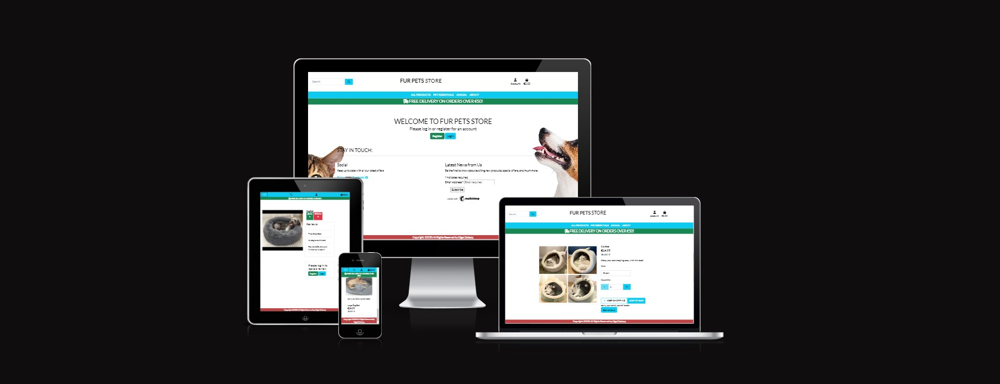

# Fur Pets Store

This is a full-stack frameworks project built using Django, Python, HTML, CSS, and JavaScript. This is a website designed for cat and god owners. This project has been built for educational purposes.

[Live application can be found here](https://fur-pets-store.herokuapp.com/)

# Table of Contents
- [Fur Pets Store](#fur-pets-store)
- [Table of Contents](#table-of-contents)
  - [User Experience](#user-experience)
  - [User Stories](#user-stories)
  - [Scope](#scope)
  - [Structure](#structure)
    - [Databases](#databases)
  - [Skeleton](#skeleton)
  - [Surface](#surface)
  - [Features](#features)
    - [Current Features](#current-features)
    - [Home page](#home-page)
  - [Technology Used](#technology-used)
  - [Testing](#testing)
    - [Code Validation](#code-validation)
    - [Manual Testing](#manual-testing)
    - [Automated Testing](#automated-testing)
    - [Bugs and Fixes](#bugs-and-fixes)
  - [Deployment](#deployment)
    - [Creating an Application with Heroku](#creating-an-application-with-heroku)
      - [Heroku](#heroku)
      - [ElephantSQl](#elephantsql)
      - [Heroku Deployment](#heroku-deployment)
  - [Credits](#credits)
  - [Acknowledgements](#acknowledgements)
  - [Gitpod Reminders](#gitpod-reminders)

## User Experience

Using the core UX principles I first started with Strategy, thinking about the target audience for this restaurant & the features they would benefit from.

The target audience for 'Fur Pets Store' are:
- People who have cats and dog.
- People that enjoy love their animal.
  
These users will be looking for:
- An informative website, with information that is easy-to-find & concise
- Current & up-to-date products, with essential information such as price, category, and images
- Ability to view & purchase prints that are for sale
- User account functionality to view past orders and store billing information

This website will offer all of these things whilst also allowing for intuitive navigation and comfortability of use.

It is assumed that there will be an even split between users viewing the website on their mobiles phone and laptops. Therefore creating something responsive is integral to the design, I have used Bootstrap grids and elements & custom CSS to allow for this.

This website will offer all of these things whilst also allowing for intuitive navigation and comfort of use. 

Due to the accessibility of mobile phones, it is assumed that most users will be viewing the site on their mobile phones and therefore creating something responsive is integral to the design, I have used Bootstrap elements & custom CSS to allow for this.

## User Stories

Please find all my defined user stories & their acceptance criteria [here](https://github.com/users/ExcellentWish/projects/6)

1. As a user I can intuitively navigate through the site so that I can view desired content.
2. 

## Scope

To achieve the desired user & business goals the following features will be included in this release:

- Responsive navbar that will navigate to the various pages throughout the site
- Landing page with brief information about the site and links to the product and catogry page
- Register/log in feature using Django allauth
- Contact form using Google SMTP

## Structure

This website has been designed with simplicity in mind, each page only has entirely relevant information on it so that the user can find what they want quickly without having to read through unnecessary things. I have separated each key feature to highlight its functionality to the user.

The website is made of apps:
1. 

### Databases

The menus and reservations app both require databases to store information so I have built custom models.

## Skeleton
[Wireframes can be viewed here](assets/wireframes/WIREFRAMES.md)

Please note the actual website differs slightly from the original wireframes.

The theme of simplicity follows through to the design, I've used bootstrap columns and rows to divide the pages and tried to keep the same layout throughout so that the user has a sense of ease when on the various pages. 
Some content has been hidden on mobiles to ensure that there is never any information overload or that the screen is taken up by content not completely required.

## Surface

## Features

### Current Features

### Home page

## Technology Used
I have used several technologies that have enabled this design to work:
- [Django](https://www.djangoproject.com/)
    - Django is the framework that has been used to build the project and its apps.
- [Python](https://www.python.org/)
    - Python is the core programming language used to write all of the code in this application to make it fully functional.
- [Bootstrap](https://getbootstrap.com/docs/5.2/getting-started/introduction/)
    - For help with HTML and CSS layout 
- [Google Fonts](https://fonts.google.com/)
    - Used to obtain the fonts linked in the header, fonts used were 'Exo' and 'Roboto'
- [Font Awesome](https://fontawesome.com/)
    - Used to obtain the icons used on the high scores and rules pages.
- [Google Developer Tools](https://developers.google.com/web/tools/chrome-devtools)
    - Used as a primary method of fixing spacing issues, finding bugs, and testing responsiveness across the project.
- [GitHub](https://github.com/)
    - Used to store code for the project after being pushed.
- [Git](https://git-scm.com/)
- [Grammerly](https://www.grammarly.com/)
  - For spell checking my readme.md
- [Amazon Web Services AWS]()
    - For media storage
- [Balsamiq](https://balsamiq.com/)
  - For wireframes and flow charts
- [Pycodestyle](https://pypi.org/project/pycodestyle/)
  - Used to test my code for any issues or errors.
- [Heroku](https://www.heroku.com/)
    - For Deployment of this website
- [Color Contrast Accessibility Validator](https://color.a11y.com/)
    - To help test colours I used
- [Coolers] (https://coolors.co)
    - To help find colours to use
- [W3C Markup Validation Service](https://validator.w3.org/) 
    - Used to validate all HTML code written and used in this webpage.
- [W3C CSS Validation Service](https://jigsaw.w3.org/css-validator/#validate_by_input)
    - Used to validate all CSS code written and used in this webpage.
- [Freeformatter CSS Beautify](https://www.freeformatter.com/css-beautifier.html)
    - Used to accurately format my CSS code.
- [Freeformatter HTML Formatter](https://www.freeformatter.com/html-formatter.html)
    - Used to accurately format my HTML code.
- [AmIResponsive](http://ami.responsivedesign.is/)
    - Used to generate responsive image used in README file.
- [Image Resizer](https://imageresizer.com/)
    - Used to help improve Lighthouse score.
- [ElephantSQL](https://www.elephantsql.com/)
  - I have ElephantSQL database in deployment to store the data for my models.

## Testing

### Code Validation

### Manual Testing
I have tested this project manually myself and have also had it peer-reviewed & tested by friends and family on multiple devices and screen sizes.
Testing document is found [here]()

### Automated Testing
I have used the Coverage library throughout testing to keep track of how much of my Python code was covered by the tests I had written. From running the coverage report my website has 66% of my code tested. The remaining code is covered by manual testing.

To generate your own coverage report from the command line:

1. Install the package using `pip3 install coverage`
2. Run `coverage run manage.py test`
3. Then `coverage html` to generate the report
4. You can view the report in a browser by using the command `python3 -m http.server` and opening the `index.html` file from inside the `htmlcov` folder.

### Bugs and Fixes

Issue with back backports.zoneinfo==0.2.1 
solution backports.zoneinfo==0.2.1;python_version<"3.9" for heroku deployment

backports.zoneinfo commented out for automatic deployment ? (test= success) 

## Deployment

To deploy my django application, I used [Code Institute Full Template](https://github.com/Code-Institute-Org/gitpod-full-template)
- Click the `Use This Template` button.
- Add a repository name and brief description. 

### Creating an Application with Heroku

I followed the below steps using the Code Institute tutorial and [Django Blog cheatsheat](https://docs.google.com/document/d/1P5CWvS5cYalkQOLeQiijpSViDPogtKM7ZGyqK-yehhQ/edit)
The following command in the Gitpod CLI will create the relevant files needed for Heroku to install your project dependencies `pip3 freeze --local > requirements.txt`. 

1. Go to Heroku.com and login; if you do not already have an account then you will need to create one.
2. Click the New dropdown and select Create New App.
3. Enter a name for your new project, all Heroku apps need to have a unique name, you will be prompted if you need to change it.
4. Select the region you are working in.

#### Heroku 

- Heroku changed their policy for a free database on their website. Below I have a section for ElephantSQL.
- When it was free this is what you would do.
    - In the resources tab you must install 'Heroku Postgres' in the add-ons section
    - You can set it to hobby for free use.

You will need to set your Environment Variables - this is a key step to ensuring your application is deployed properly.
- In the Settings tab, click on `Reveal Config Vars` and set the following variables:
    - Add key: `PORT` & value `8000`
    - SECRET_KEY - to be set to your chosen key
    - DATABASE_URL - Using ElephantSQL
    - DISABLE_COLLECTSTATIC, 1 - Until its ready for release

#### ElephantSQl

- For this project, I used ElephantSQL for the database, as Heroku changed their policy for use of their free database.
- Login or create an account with [ElephantSQL.com]([ElephantSQL.com](https://www.elephantsql.com/)) to access your dashboard.
- Click `Create New Instance`. A green button is on the right side of the page.
- Set up your plan
    - Give your plan a `Name` (this is commonly the name of the project)
    - Select the `Tiny Turtle` (Free) plan
    - You can leave the Tags field blank
- Select a data center near you.
    - For this, I used `EU-west-1(Ireland)` 
- Then click `Review`
- Check your details are correct and then click `Create instance`
- Return to the ElephantSQL dashboard and click on the `database instance name` for your project
- In the URL section, click the copy icon to copy the `database URL`
- Copy to Heroku `Reveal Config Vars`
  
#### Heroku Deployment

In the Deploy tab:
1. Connect your Heroku account to your Github Repository following these steps:
2. Click on the `Deploy` tab and choose `Github-Connect to Github`.
3. Enter the GitHub repository name and click on `Search`.
4. Choose the correct repository for your application and click on `Connect`.
5. You can then choose to deploy the project manually or automatically, automatic deployment will generate a new application every time you push a change to Github, whereas manual deployment requires you to push the `Deploy Branch` button whenever you want a change made.
6. Once you have chosen your deployment method and have clicked `Deploy Branch` your application will be built and you should see the below `View` button, click this to open your application:

## Credits

https://codepen.io/scanfcode for footer

## Acknowledgements

I would like to thank my course mentor Ronan McClelland for his support and guidance throughout the project and Kasia Bogucka and my peers from Msletb slack group for their support & feedback. Code Institute Slack channels for a massive resource of information and help.

Project 5 of code institute
## Gitpod Reminders

To run a frontend (HTML, CSS, Javascript only) application in Gitpod, in the terminal, type:

`python3 -m http.server`

A blue button should appear to click: _Make Public_,

Another blue button should appear to click: _Open Browser_.

To run a backend Python file, type `python3 app.py`, if your Python file is named `app.py` of course.

A blue button should appear to click: _Make Public_,

Another blue button should appear to click: _Open Browser_.

In Gitpod you have superuser security privileges by default. Therefore you do not need to use the `sudo` (superuser do) command in the bash terminal in any of the lessons.

To log into the Heroku toolbelt CLI:

1. Log in to your Heroku account and go to *Account Settings* in the menu under your avatar.
2. Scroll down to the *API Key* and click *Reveal*
3. Copy the key
4. In Gitpod, from the terminal, run `heroku_config`
5. Paste in your API key when asked

You can now use the `heroku` CLI program - try running `heroku apps` to confirm it works. This API key is unique and private to you so do not share it. If you accidentally make it public then you can create a new one with _Regenerate API Key_.

------

