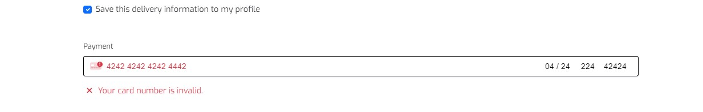

# Fur Pets Store

This is a full-stack frameworks project built using Django, Python, HTML, CSS, and JavaScript. This is a website designed for cat and god owners. This project has been built for educational purposes.

[Live application can be found here](https://fur-pets-store.herokuapp.com/)

# Table of Contents
- [Fur Pets Store](#fur-pets-store)
- [Table of Contents](#table-of-contents)
  - [Business Model](#business-model)
  - [User Experience](#user-experience)
    - [Strategy](#strategy)
  - [User Stories](#user-stories)
    - [**Epic 1 - Core Functionality**:](#epic-1---core-functionality)
    - [**Epic 2 - Admin Functionality**:](#epic-2---admin-functionality)
    - [**Epic 3 - User Account**:](#epic-3---user-account)
    - [**Epic 4 - Products**:](#epic-4---products)
    - [**Epic 5 - Orders and Basket**:](#epic-5---orders-and-basket)
    - [**Epic 6 - Marketing**:](#epic-6---marketing)
    - [**Epic 7 - Customer Reviews**:](#epic-7---customer-reviews)
  - [Scope](#scope)
  - [Structure](#structure)
    - [Database](#database)
      - [**User Account**](#user-account)
      - [**Products App**](#products-app)
      - [**Checkout**](#checkout)
      - [**Reviews**](#reviews)
  - [Skeleton](#skeleton)
  - [Surface](#surface)
  - [Marketing](#marketing)
    - [Plan](#plan)
    - [SEO's](#seos)
  - [Features](#features)
    - [Navbar](#navbar)
    - [Footer](#footer)
    - [Home page](#home-page)
    - [About](#about)
    - [Privacy Policy](#privacy-policy)
    - [Terms \& Conditions](#terms--conditions)
    - [All products](#all-products)
    - [Basket](#basket)
    - [Checkout](#checkout-1)
    - [User profile](#user-profile)
    - [User wishlist](#user-wishlist)
    - [Admin](#admin)
      - [**Product management**](#product-management)
      - [Review](#review)
    - [Error pages](#error-pages)
    - [Gmail SMTP](#gmail-smtp)
    - [Stripe](#stripe)
    - [AWS static and media storage](#aws-static-and-media-storage)
  - [Technology Used](#technology-used)
  - [Testing](#testing)
    - [Code Validation](#code-validation)
    - [Manual Testing](#manual-testing)
    - [Automated Testing](#automated-testing)
    - [Bugs and Fixes](#bugs-and-fixes)
  - [Deployment](#deployment)
    - [Creating an Application with Heroku](#creating-an-application-with-heroku)
      - [Heroku](#heroku)
      - [ElephantSQl](#elephantsql)
      - [Heroku Deployment](#heroku-deployment)
  - [Credits](#credits)
  - [Acknowledgements](#acknowledgements)

## Business Model
It is a B2C business model, with targeted customer being individuals, and focus on single transactions. It is aiming to target individuals who is interested in online shopping, pet lovers and looking for unique pet toys. Or people who want to purchase unique gifts for their family or friends pets. Products sourced from AliExpress and can be dropshipped to a customer.

## User Experience

### Strategy

Using the core UX principles I first started with Strategy, thinking about the target audience for this pet store & the features they would benefit from.

The target audience for 'Fur Pets Store' are:
- People who have cats and dog.
- People that enjoy love their animal.
  
These users will be looking for:
- An informative website, with information that is easy-to-find & concise
- Current & up-to-date products, with essential information such as price, category, and images
- Ability to view & purchase pet toys that are for sale
- User account functionality to view past orders and store billing information

This website will offer all of these things whilst also allowing for intuitive navigation and comfortability of use.

It is assumed that there will be an even split between users viewing the website on their mobiles phone and laptops. Therefore creating something responsive is integral to the design, I have used Bootstrap grids and elements & custom CSS to allow for this.

This website will offer all of these things whilst also allowing for intuitive navigation and comfort of use. 

Due to the accessibility of mobile phones, it is assumed that most users will be viewing the site on their mobile phones and therefore creating something responsive is integral to the design, I have used Bootstrap elements & custom CSS to allow for this.

## User Stories

Please find all my defined user stories & their acceptance criteria [here](https://github.com/users/ExcellentWish/projects/6)

### **Epic 1 - Core Functionality**:
1. [Intuitive Navigation](https://github.com/ExcellentWish/fur-pet-store/issues/1): 
2. [Navbar & Footer ](https://github.com/ExcellentWish/fur-pet-store/issues/2):
3. [Informative Landing Page ](https://github.com/ExcellentWish/fur-pet-store/issues/3)
4. [Responsive Design](https://github.com/ExcellentWish/fur-pet-store/issues/4)
5. [Messages Displayed to User ](https://github.com/ExcellentWish/fur-pet-store/issues/5)

### **Epic 2 - Admin Functionality**:
1. [Admin can Login and Access Backend](https://github.com/ExcellentWish/fur-pet-store/issues/6): 
2. [Products have CRUD Functionality](https://github.com/ExcellentWish/fur-pet-store/issues/7):
3. [Product Managment Access](https://github.com/ExcellentWish/fur-pet-store/issues/8):
4.  [Stock Levels can be Updated](https://github.com/ExcellentWish/fur-pet-store/issues/9):
    
### **Epic 3 - User Account**:
1. [User can Create an Account](https://github.com/ExcellentWish/fur-pet-store/issues/10):
2. [Logged in Status Clear to User](https://github.com/ExcellentWish/fur-pet-store/issues/11)
3. [Prompt User to Create an Account](https://github.com/ExcellentWish/fur-pet-store/issues/12)
4. [User Profile](https://github.com/ExcellentWish/fur-pet-store/issues/13)

### **Epic 4 - Products**:
1. [Products can be Viewed](https://github.com/ExcellentWish/fur-pet-store/issues/14):
2. [Product Information is Clear](https://github.com/ExcellentWish/fur-pet-store/issues/15)
3. [Filter View for Products](https://github.com/ExcellentWish/fur-pet-store/issues/16)
4. [Out of Stock Products Clearly Lablled](https://github.com/ExcellentWish/fur-pet-store/issues/17)

### **Epic 5 - Orders and Basket**:
1. [Orders can be Placed](https://github.com/ExcellentWish/fur-pet-store/issues/18):
2. [Basket Breakdown](https://github.com/ExcellentWish/fur-pet-store/issues/19):
3. [Out of Stock Products Cannot be Added to the Basket.](https://github.com/ExcellentWish/fur-pet-store/issues/20):
4. [Order Confirmations Emailed To User](https://github.com/ExcellentWish/fur-pet-store/issues/21):

### **Epic 6 - Marketing**:
1. [Facebook Page](https://github.com/ExcellentWish/fur-pet-store/milestone/6)
2. [SEO Keywords](https://github.com/ExcellentWish/fur-pet-store/issues/23):
3. [Users can Sign Up for a Newsletter](https://github.com/ExcellentWish/fur-pet-store/issues/24):

### **Epic 7 - Customer Reviews**:
1. [Can See Reviews on Product](https://github.com/ExcellentWish/fur-pet-store/issues/26)
2. [Customer Can Like and Dislike Products](https://github.com/ExcellentWish/fur-pet-store/issues/27):
3. [View Reviews](https://github.com/ExcellentWish/fur-pet-store/issues/28):
4. [Manage Review](https://github.com/ExcellentWish/fur-pet-store/issues/29)
   
## Scope

To achieve the desired user & business goals the following features will be included in this release:

- Responsive navbar that will navigate to the various pages throughout the site
- Landing page with brief information about the site and links to the product and catogry page and newsletter signup.
- Shop page, that displays all products available for purchase with the option to filter on the product category.
- Reviews page, that displays reviews on a product.
- Register/log in feature using Django allauth
- Custom 404 and 500 error pages.
- Contact form using Google SMTP

This website has been designed with simplicity in mind, each page only has entirely relevant information on it so that the user can find what they want quickly without having to read through unnecessary things. I have separated each key feature to highlight its functionality to the user.

## Structure

### Database
I opted to connect to the  PostgreSQL database from the beginning which is provided by ElephantSQL as Heroku have changed theie policy for a free database. For almost all of the apps (aside from home) I have created models, the Entity-Relationship Diagram below shows how the database models relate to each other: 

This has been updated to include my wishlist and review

#### **User Account**
This app enables authenticated users to save their information so that when they are logged in the order form is pre-filled, creating an improved user experience. The `UserProfile` model has a one-to-one field that is linked to the Django AllAuth user account, upon logging in the model method `create_or_update_user_profile` creates the profile if it isn't already present in the model.

The second model in this app is `UserWishlist`, this model has two foreign keys, one relating to the `UserProfile` and the other is `Product`. This model stores the products that the user wants to be saved to their wishlist. This information is then displayed in the wishlist view.

#### **Products App**
This app controls the products that are displayed in the online shop. I have created two models to store the necessary data: `Products` & `Category`.

`Products` enables individual products to be added to the database in order for them to be purchased via the online shop. Only admin users are able to access this functionality and it can be done from the front end using the `add_product` view. This model has one FK which relates to the second model in this app, the category. This was edited from boutique ado as I can add the `animal_choice` and if a product `has_color` and a `in_stock` option.

`Category` stores the various category types of the products on sale, this allows the user to filter the shop page by the category if they are looking for something specific.

#### **Checkout**

The checkout app is used solely for the user to make purchases via the online shop; this app contains two models, `Order` & `OrderLineItem`. 

`OrderLineItem` contains all of the information regarding the products that have been purchased as part of a specific order. It has a foreign key to `Product` & `Order`, it also contains the quantity purchased of that product and then the item total. This information is used to calculate the total cost for the order. For the product FK I chose to use `on_delete=models.CASCADE`, using the 'original basket' field the admin can still see what the original purchase was.

`Order` contains all of the relevant address information for billing/shipping, a foreign key to the `UserProfile`, email & phone number. It also contains information regarding the payment itself, the stripe PID, original basket contents (so that if the order is changed, the admin user can see what was purchased initially). Each order has an order number which is automatically generated when a new order is added to the database using `UUID`.

There are some other model methods used at various points, `order.full_address` collates all of the users' address details in one f string, used when sending the confirmation email to the user. 

`update_total` calculates the overall total depending on the order items linked to the order, ensuring the value is always correct.

#### **Reviews**

The reviews app contains one model - `Reviews` - that enables the admin or user to add reviews to the database in order to be displayed on the website. This model has connections with the products and user. The information added is `title, body, user , date and time` and `approved` which allows the admin to decide what is displayed on the website. There are a few model methods in place that calculate the `likes` and `dislikes` depending on if the product has been reviewed as it allows users to know that the product was bought before.

## Skeleton
[Wireframes can be viewed here](assets/wireframes/WIREFRAMES.md)

Please note the actual website differs slightly from the original wireframes.

The theme of simplicity follows through to the design, I've used bootstrap columns and rows to divide the pages and tried to keep the same layout throughout so that the user has a sense of ease when on the various pages. 
Some content has been hidden on mobiles to ensure that there is never any information overload or that the screen is taken up by content not completely required.

## Surface
Animals only see in black and white is a myth. It was once thought that animals, including cats and dogs, could only see in black and white. However, scientists have proven this to be a myth. In all animals, including humans, the perception of colour is determined by the presence of cells in the eye called cone photoreceptors. Cats and dogs have two kinds of cones, which are sensitive to blue and green light

Cats and dogs are colour blind. Fact. To see in full colour as we know it, humans use three cones – red, blue and green. However cats and dogs only have blue and green cones. This means they have a much more muted perception of colour, which is akin to colour blindness in humans. 

The source of this information is from https://adelaidevet.com.au/pet-library/can-animals-see-colour#:~:text=Fact,to%20colour%20blindness%20in%20humans.

Which is why you will see the colors red, blue and green throughout my project.

I chose the font Exo.I wanted a bold/statement font to use for headings which is why I chose 'Exo', I also believe it is good for the general content as it's easier to read for the user.

## Marketing

### Plan

Fur Pets store's website is a business to customer e-commerce platform, built and designed to sell products to the user & inform customers about product with reviews. Before beginning this project I wrote a marketing plan which can be found here:

[Marketing plan](assets/documents/marketing-plan.dox)

To further enhance sales there is also a Facebook page, that will display information about new products that are for sale:

Users are also able to subscribe to receive a newsletter, using the MailChimp form found in the index.html. With the link to our facebook page. 

### SEO's

I conducted SEO research to decide on the keywords and phrases that would be used across the website, I wrote a list of as many words and phrases I could think of and then using Google, I searched by these keywords to see the sort of websites that were returned. 

In addition to my research, once the bulk of the website had been built I used an online tool called [Semrush](https://www.semrush.com/) which provided a report on ways that I could improve my SEO. I chose the keep the meta tags and descriptions the same across each page as the content wouldn't have varied too much and there would have been a lot of replication. By using the name of the breed of a cat or dog, it impoved my SEO.

## Features

### Navbar

I have implemented a fixed navbar that remains at the top of the screen at all times, allowing the user to easily navigate through the website. Furthermore, it is responsive and so it collapses into a burger menu on smaller screens.

On mobile, the menu is a list displayed on the left, with search , user and basket displayed horizontal:

The basket icon with a subtotal displayed below it, to allow the user to keep track of the cost of the products in their basket.

### Footer
The footer keeps with the colour theme as the surface. I wanted this information displayed as part of the footer so the user can find it. However it made the page look clunky, so I opted for a slim and easy footer that takes a user to my github and give a copy-right date.

Here is my old style of footer

Here is my current style of footer

### Home page

The home page, in keeping with the theme, is very simple. There is an `h1` title followed by an `h4` message. I wanted to create a carousel of the products to showcase, but I didn't like it. 

Instead I opted to use this for the marketing, by adding the Facebook links and Mailchimp. I like this better as it was simple but effective.

### About

The about page provides an insight into Fur-pets, the ethos and a link to help animal charities; there is also a link to the products page to encourage the user to continue exploring the website and to increase the chance of sales.

### Privacy Policy
Privacy Policy, one of the most important policy for online business, privacy policy explains how we collect, use, and protect your personal information when you use our website or services.To demostrate that we take GDPR very serious. [Privacy Policy Generator](https://www.privacypolicygenerator.info/) was used to generate the privacy policy.

### Terms & Conditions
Terms & Conditions [Generator](https://www.freeprivacypolicy.com/free-terms-and-conditions-generator/) used for an "Agreement" for use of the website and services. 

### All products
This page displays all of the products sold on the site, displayed in a grid of bootstrap cards, each product has an image, product title, price and rating.

Additionally, if a user is logged in then an empty love heart icon is displayed with add to wishlist, once clicked this will add the product to the user's wishlist and the icon becomes solid. If clicked again the product is removed from the wishlist and the heart becomes empty again.

The cards and columns are all responsive so that on mobile there is the same functionality and the images aren't warped.

### Basket

The basket page provides an overview of all of the items added by the user, the information is displayed in a table that has product name, image, quantity, price and subtotal. The user can amend the quantity of each product and also remove it whilst on this page and below there are buttons to proceed to the checkout or to keep shopping.  

If there is nothing in the basket then there is no table is displayed, and instead a message that says 'your bag is empty.'

### Checkout

This page is where the user can complete their purchase, split into two columns, billing & card details on one side and their basket overview on the other. The forms are simple, with placeholders explaining what each input is for.

The card payment feature has been built using [Stripe](https://stripe.com/ie), to make test payments I have used the card details found in Stripe docs:

So upon submission of the payment form information is passed to stripe and then back, if successful the user is taken to the 'checkout success' page, which displays the order number and delivery details. 

If the payment is not successful, the form does not submit, an inline error message is displayed and the user is able to rectify the issues.

### User profile
A logged-in user can access the `my profile` link, this page displays `personal details update`, ` previous orders` and `wishlist` link.

The personal details is where the user can update their default shipping/billing address and contact information.

The previous order displays a list of all the orders previously made by the user and a link to wishlist page from the user

### User wishlist

Wishlist displays the list of items the user has saved to their wishlist, with the ability to remove the product.

### Admin
The admin section of this website allows a logged-in superuser to update the products stock and add products from the front end.

#### **Product management**
Products can be added using the `product management` dropdown, the superuser is taken to a form whereupon submission the product is added to the model:

Products can be edited or deleted using the `edit` or `delete`  buttons on the product pages.

The superuser is taken to a form whereupon submission the product is edited to the model:

If the superuser tries to delete a product a modal is displayed to verify the cancelation:

#### Review
For the  product review I have a button that takes the user to the review page:

In the review page there is a like and dislike button with a counter. This helps a customer in their decision when purchasing a product.
A customer can also leave a review `edit` or `delete` their review

If a product has no reviews, but a customer can leave one.

Only a user that is logged in can leave a review.

### Error pages

The error templates was made by [Colorlib](https://colorlib.com/wp/template/colorlib-error-404-18/), this allows the user to easily navigate back to the home page should they experience any errors.

### Gmail SMTP

I have used Gmail SMTP to send confirmation emails and all AllAuth related emails when the deployed version is used. I used the following [documentation](https://kb.synology.com/en-global/SRM/tutorial/How_to_use_Gmail_SMTP_server_to_send_emails_for_SRM) to set it up and add these settings to my settings.py file.

### Stripe

In order to take payments for the online store, I implemented Stripe; you first must create an account with them and then using the [documentation](https://stripe.com/docs/payments/quickstart) add the relevant HTML, python & JS code suitable for your needs.

### AWS static and media storage

All static and media files are stored in the cloud using Amazon AWS S3; I have created a bucket, user group and user that can access this site and the relevant files. In order for the files to be correctly served the following settings have to be added to your main settings.py file.

## Technology Used
I have used several technologies that have enabled this design to work:
- [Django](https://www.djangoproject.com/)
    - Django is the framework that has been used to build the project and its apps.
- [Python](https://www.python.org/)
    - Python is the core programming language used to write all of the code in this application to make it fully functional.
- [Bootstrap](https://getbootstrap.com/docs/5.2/getting-started/introduction/)
    - For help with HTML and CSS layout 
- [Google Fonts](https://fonts.google.com/)
    - Used to obtain the fonts linked in the header, fonts used were 'Exo' and 'Roboto'
- [Font Awesome](https://fontawesome.com/)
    - Used to obtain the icons used on the high scores and rules pages.
- [Google Developer Tools](https://developers.google.com/web/tools/chrome-devtools)
    - Used as a primary method of fixing spacing issues, finding bugs, and testing responsiveness across the project.
- [GitHub](https://github.com/)
    - Used to store code for the project after being pushed.
- [Git](https://git-scm.com/)
- [Grammerly](https://www.grammarly.com/)
  - For spell checking my readme.md
- [Amazon Web Services AWS]()
    - For media storage
- [Lucid](https://www.lucidchart.com/pages/)
  - For wireframes and flow charts
- [Pycodestyle](https://pypi.org/project/pycodestyle/)
  - Used to test my code for any issues or errors.
- [Heroku](https://www.heroku.com/)
    - For Deployment of this website
- [Color Contrast Accessibility Validator](https://color.a11y.com/)
    - To help test colours I used
- [Coolers](https://coolors.co)
    - To help find colours to use
- [W3C Markup Validation Service](https://validator.w3.org/) 
    - Used to validate all HTML code written and used in this webpage.
- [W3C CSS Validation Service](https://jigsaw.w3.org/css-validator/#validate_by_input)
    - Used to validate all CSS code written and used in this webpage.
- [Freeformatter CSS Beautify](https://www.freeformatter.com/css-beautifier.html)
    - Used to accurately format my CSS code.
- [Freeformatter HTML Formatter](https://www.freeformatter.com/html-formatter.html)
    - Used to accurately format my HTML code.
- [AmIResponsive](http://ami.responsivedesign.is/)
    - Used to generate responsive image used in README file.
- [Image Resizer](https://imageresizer.com/)
    - Used to help improve Lighthouse score.
- [ElephantSQL](https://www.elephantsql.com/)
  - I have ElephantSQL database in deployment to store the data for my models.

## Testing

I have used a combination of manual and automated testing to ensure the website's functionality meets the desired intent.

### Code Validation
[W3C Markup Validation Service](https://validator.w3.org/) 

[W3C CSS Validation Service](https://jigsaw.w3.org/css-validator/#validate_by_input)

[JSHint](https://jshint.com/)

### Manual Testing
I have tested this project manually myself and have also had it peer-reviewed & tested by friends and family on multiple devices and screen sizes.
Testing document is found [here](TESTING.md)

### Automated Testing
I have used the Coverage library throughout testing to keep track of how much of my Python code was covered by the tests I had written. From running the coverage report my website has 58% of my code tested. The remaining code is covered by manual testing.

To generate your own coverage report from the command line:

1. Install the package using `pip3 install coverage`
2. Run `coverage run manage.py test`
3. Then `coverage html` to generate the report
4. You can view the report in a browser by using the command `python3 -m http.server` and opening the `index.html` file from inside the `htmlcov` folder.

### Bugs and Fixes

Issue with back backports.zoneinfo==0.2.1 
solution backports.zoneinfo==0.2.1;python_version<"3.9" for heroku deployment

backports.zoneinfo commented out for automatic deployment ? (test= success) 

context processor error when adding size to bag view for 8 'dict' 
## Deployment

To deploy my django application, I used [Code Institute Full Template](https://github.com/Code-Institute-Org/gitpod-full-template)
- Click the `Use This Template` button.
- Add a repository name and brief description. 

### Creating an Application with Heroku

I followed the below steps using the Code Institute tutorial and [Django Blog cheatsheat](https://docs.google.com/document/d/1P5CWvS5cYalkQOLeQiijpSViDPogtKM7ZGyqK-yehhQ/edit)
The following command in the Gitpod CLI will create the relevant files needed for Heroku to install your project dependencies `pip3 freeze --local > requirements.txt`. 

1. Go to Heroku.com and login; if you do not already have an account then you will need to create one.
2. Click the New dropdown and select Create New App.
3. Enter a name for your new project, all Heroku apps need to have a unique name, you will be prompted if you need to change it.
4. Select the region you are working in.

#### Heroku 

- Heroku changed their policy for a free database on their website. Below I have a section for ElephantSQL.
- When it was free this is what you would do.
    - In the resources tab you must install 'Heroku Postgres' in the add-ons section
    - You can set it to hobby for free use.

You will need to set your Environment Variables - this is a key step to ensuring your application is deployed properly.
- In the Settings tab, click on `Reveal Config Vars` and set the following variables:
    - Add key: `PORT` & value `8000`
    - SECRET_KEY - to be set to your chosen key
    - DATABASE_URL - Using ElephantSQL
    - DISABLE_COLLECTSTATIC, 1 - Until its ready for release

#### ElephantSQl

- For this project, I used ElephantSQL for the database, as Heroku changed their policy for use of their free database.
- Login or create an account with [ElephantSQL.com]([ElephantSQL.com](https://www.elephantsql.com/)) to access your dashboard.
- Click `Create New Instance`. A green button is on the right side of the page.
- Set up your plan
    - Give your plan a `Name` (this is commonly the name of the project)
    - Select the `Tiny Turtle` (Free) plan
    - You can leave the Tags field blank
- Select a data center near you.
    - For this, I used `EU-west-1(Ireland)` 
- Then click `Review`
- Check your details are correct and then click `Create instance`
- Return to the ElephantSQL dashboard and click on the `database instance name` for your project
- In the URL section, click the copy icon to copy the `database URL`
- Copy to Heroku `Reveal Config Vars`
  
#### Heroku Deployment

In the Deploy tab:
1. Connect your Heroku account to your Github Repository following these steps:
2. Click on the `Deploy` tab and choose `Github-Connect to Github`.
3. Enter the GitHub repository name and click on `Search`.
4. Choose the correct repository for your application and click on `Connect`.
5. You can then choose to deploy the project manually or automatically, automatic deployment will generate a new application every time you push a change to Github, whereas manual deployment requires you to push the `Deploy Branch` button whenever you want a change made.
6. Once you have chosen your deployment method and have clicked `Deploy Branch` your application will be built and you should see the below `View` button, click this to open your application:

## Credits

https://codepen.io/scanfcode for footer

## Acknowledgements

I would like to thank my course mentor Ronan McClelland for his support and guidance throughout the project and Kasia Bogucka and my peers from Msletb slack group for their support & feedback. Code Institute Slack channels for a massive resource of information and help.
