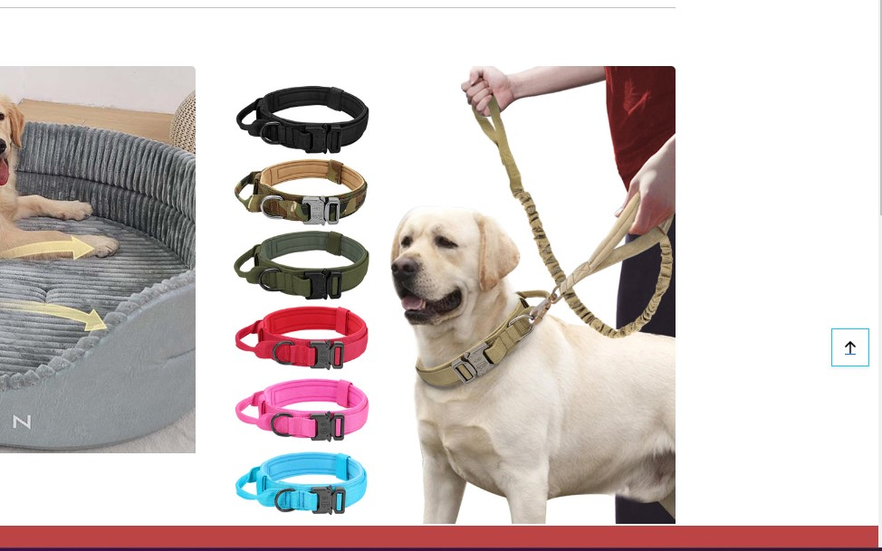
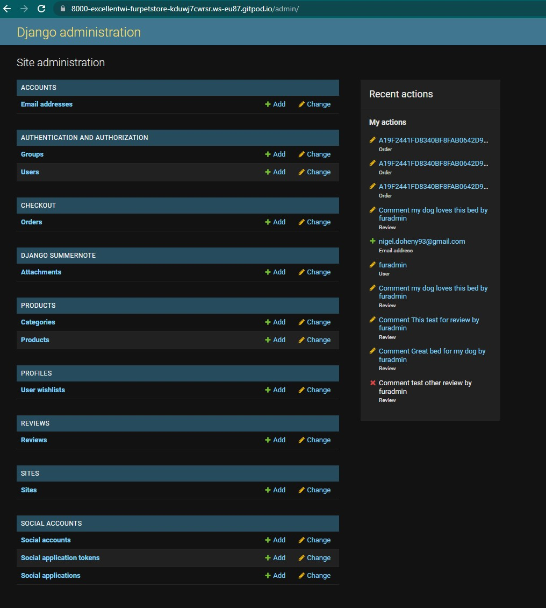
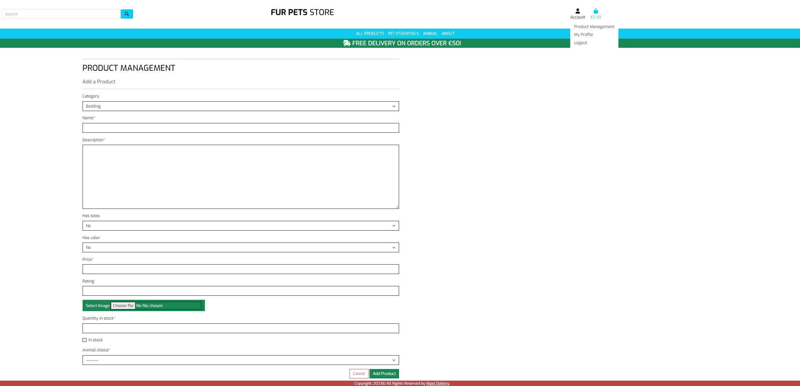
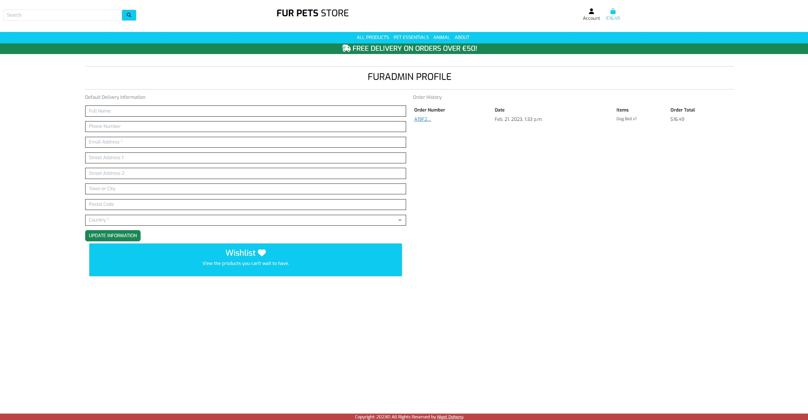
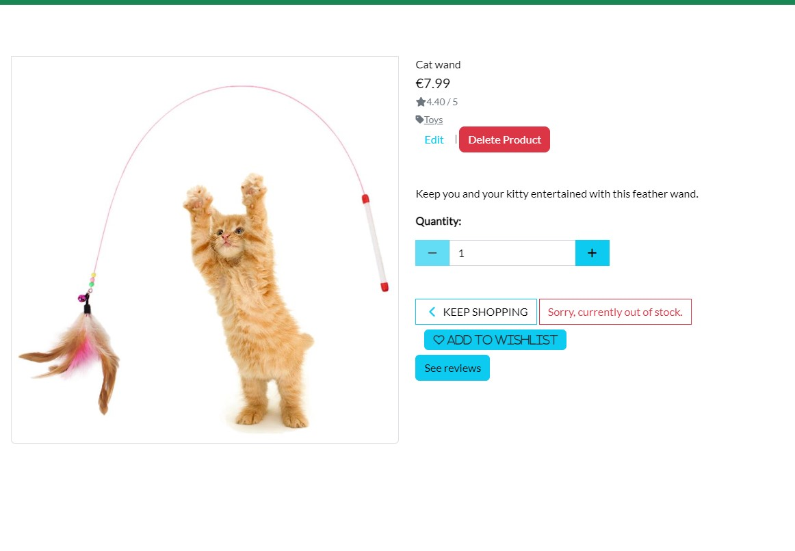
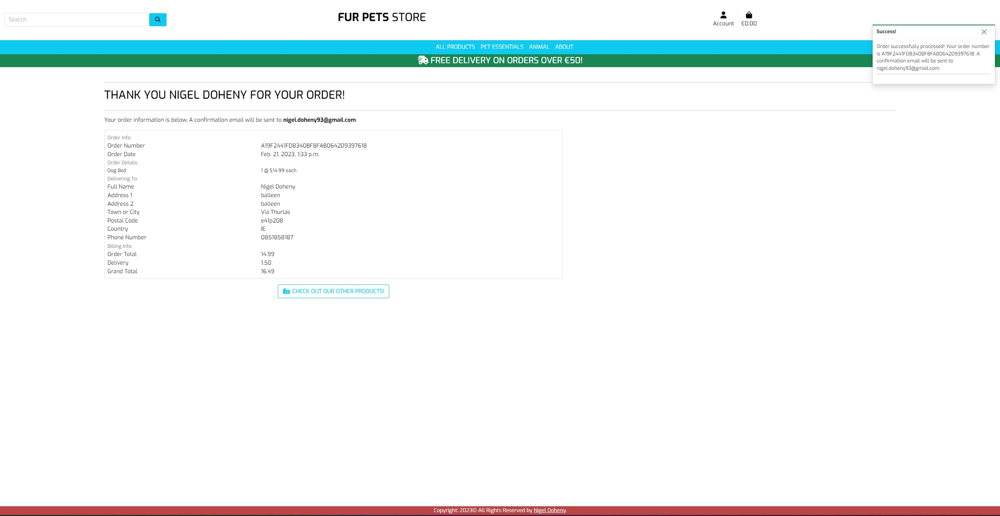

# Manual Testing

[Back to main README](README.md)

## Epic 1 - Core website functionality

### User Stories

1. [Intuitive Navigation](https://github.com/ExcellentWish/fur-pet-store/issues/1):
2. [Navbar & Footer ](https://github.com/ExcellentWish/fur-pet-store/issues/2):
3. [Informative Landing Page ](https://github.com/ExcellentWish/fur-pet-store/issues/3)
4. [Responsive Design](https://github.com/ExcellentWish/fur-pet-store/issues/4)
5. [Messages Displayed to User ](https://github.com/ExcellentWish/fur-pet-store/issues/5)

- The navigation bar is fixed at the top of the screen, meaning it is always seen by the user, allowing the user to navigate through the content easily & intuitively. Each nav link is named with an obvious link to the page content, for the shop and admin links there are dropdowns for subsections of the website so that there isn't too much information in the navbar.

- I have added a back to top button that appears when the user scrolls down any of the pages, enabling them to quickly navigate back to the top without having to scroll:

- The footer is at the bottom of the page is a simple one with copyright and cretor

 As a **user** I am notified about any changes I have made so that I have a clear understanding of what has been completed/updated/failed.

- I have used bootstrap toasts to display messages to the user at various points throughout their customer journey. The success toast is used often and when adding a product to the basket also displays a short basket overview:

- I have also used info, warning and error toasts to display various other messages; this ensures the user has awareness of any changes that have been made or have been unsuccessful:
  
As a **user** I can access the website on both mobile and desktop so that I can view the information regardless of my location.

- As I have used bootstrap the website is entirely responsive and can be viewed on any size screen and have the same functionality; however, some non-critical content has been hidden on smaller screens to enhance the user experience.
  
  

## Epic 2 - Admin functionality
### User Stories

1. [Admin can Login and Access Backend](https://github.com/ExcellentWish/fur-pet-store/issues/6): 
2. [Products have CRUD Functionality](https://github.com/ExcellentWish/fur-pet-store/issues/7):
3. [Product Managment Access](https://github.com/ExcellentWish/fur-pet-store/issues/8):
4. [Stock Levels can be Updated](https://github.com/ExcellentWish/fur-pet-store/issues/9):

As an **admin user** I can log in so that I can access the site's backend.

- Using a specified superuser account an admin user can access the `/admin` URL and login, they will then be taken to the 'Django Administration' page:

As an **admin user** I am able to log in to see the product management page so that I can make changes in the front end.

- Once logged in as an admin superuser the account navbar displays `product management`, clicking this shows the below menu:
- From here, if the user clicks `product management` they are taken to the product management page. This page displays a form to add products to the site.

As an **admin user** I can edit/remove items from the product model so that I can make sure the website is up to date and accurately reflects what is being sold.

- The `edit` button takes the user to a specified edit page, the user can only edit the stock level using the form. 

- The `delete` button takes the user to a specified delete page for the product.

- If the user clicks `delete product` then a modal pops up to ensure that the user definitely wants to delete the product and has not pressed this by mistake

- If the user clicks `yes, delete` then the product is deleted from the model, the user is taken back to the product management page and a toast confirming the deletion appears.

As an **admin user** I can update the stock levels for the products so that customers are only able to purchase items in stock.

- In the a column of the product management table  `Quantity in stock` , the user can update stock levels or mark it out of stock. They can also decide if it is for a `cat or dog`.

## Epic 3 - User Authentication
### User Stories
1. [User can Create an Account](https://github.com/ExcellentWish/fur-pet-store/issues/10):
2. [Logged in Status Clear to User](https://github.com/ExcellentWish/fur-pet-store/issues/11)
3. [Prompt User to Create an Account](https://github.com/ExcellentWish/fur-pet-store/issues/12)
4. [User Profile](https://github.com/ExcellentWish/fur-pet-store/issues/13)

As a **user** I am prompted to register for an account so that I can create an account and receive the benefits of having a profile.

- The register link in the index is the first prompt for a user to log in or create an account:

As a **user** I can easily see if I'm logged in or not so that I can choose to log in or log out.
- When the user logs on there is a message to the user: 
  

- Also when they log out:

- and if the user is not authenticated then `register` and `login` are displayed. This differentiation makes it very clear and obvious to the user if they are currently logged in:

 As a **user** I can register & login so that I can view my orders/wishlist.

- Once a user is logged in, they will be able to access `my profile`

Here they can see there previous orders and wishlist.

## Epic 4 -  Products
### User Stories
1. [Products can be Viewed](https://github.com/ExcellentWish/fur-pet-store/issues/14):
2. [Product Information is Clear](https://github.com/ExcellentWish/fur-pet-store/issues/15)
3. [Filter View for Products](https://github.com/ExcellentWish/fur-pet-store/issues/16)
4. [Out of Stock Products Clearly Lablled](https://github.com/ExcellentWish/fur-pet-store/issues/17)

As a **user** I can view all products that are in stock and available to buy

- Using the `product category` linksthe user is directed to the `products` page, this is a view that returns all products in the product model.

 As a **user** I can easily find all of the relevant information about the products so that I can make informed decisions before purchasing.

- Each product card displays a name, size, price and colour if it has the option giving the user all information they could want before deciding to buy

 As a **user** I can filter by categories to have more control over what I'm viewing.

- At the top of the products page are four buttons that allow the user to filter by category:

- Clicking on one of these buttons sends a query to the database and returns the relevant products:

 As a **user** I can easily identify prints that are not in stock so that I can avoid later frustration if they are not available.

- Products have a clear `'sorry, not in stock'`  and the add to bag button is disabled so that it is extremely clear for the user this product cannot currently be purchased.

## Epic 5 - Orders and Basket
### User Stories
1. [Orders can be Placed](https://github.com/ExcellentWish/fur-pet-store/issues/18):
2. [Basket Breakdown](https://github.com/ExcellentWish/fur-pet-store/issues/19):
3. [Out of Stock Products Cannot be Added to the Basket.](https://github.com/ExcellentWish/fur-pet-store/issues/20):
4. [Order Confirmations Emailed To User](https://github.com/ExcellentWish/fur-pet-store/issues/21):

 As a **user** I am able to process orders by making a card payment.

- Using Stripe, each time the checkout page is loaded a payment intent is created and a card element is injected into the page. Using the test card details from the Stripe documentation you can test the checkout process, if successful the user is redirected to the checkout success page.

 As a **user** I can view a breakdown of their current basket so that I can make changes if required.

- The basket page displays all of the information regarding the users current basket, product name & image, subtotal and quantity.

- The plus or minus buttons will change the quantity in the select box and then pressing update pushes those changes to the user's current basket.

As a **user** I can only add prints to my basket that are in stock so that I can avoid later frustration if my order cannot be fulfilled.

- As the `add to bag` button is removed the user is not easily able to add any product to the basket. However, if they were to try and overwrite the URL by changing the product pk passed, then I have used defensive programming so that if the required data is not passed through the post request the user is shown an error message and they are redirected back to the all_products page.

As a **user** I receive order confirmations to be sure my order has been processed.

- Upon submitting the payment form, if successful and the user is redirected to checkout success then the `send_confirmation_email` function is called, which uses the email address from the order form, this function sends an email that has the order total, shipping details, order number and products purchased in:

## Epic 6 - Marketing
### User Stories
1. [Facebook Page](https://github.com/ExcellentWish/fur-pet-store/milestone/6)
2. [SEO Keywords](https://github.com/ExcellentWish/fur-pet-store/issues/23):
3. [Users can Sign Up for a Newsletter](https://github.com/ExcellentWish/fur-pet-store/issues/24):

## Epic 7- Customer Reviews
### User Stories
1. [Customer See Reviews on Product](https://github.com/ExcellentWish/fur-pet-store/issues/26)
2. [Customer Can Like and Dislike Products](https://github.com/ExcellentWish/fur-pet-store/issues/27)
3. [View Reviews](https://github.com/ExcellentWish/fur-pet-store/issues/28)
4. [Manage reviews](https://github.com/ExcellentWish/fur-pet-store/issues/29)
 

## JavaScript Tests

I have written a small number of JS functions that handle some animation & event listeners to add classes and attributes to elements created dynamically.

**`deleteProductModal`** - This function opens the confirmation modal when a superuser is trying to delete a product.

**`deleteModal`** - This function opens the confirmation modal when a user is trying to delete.